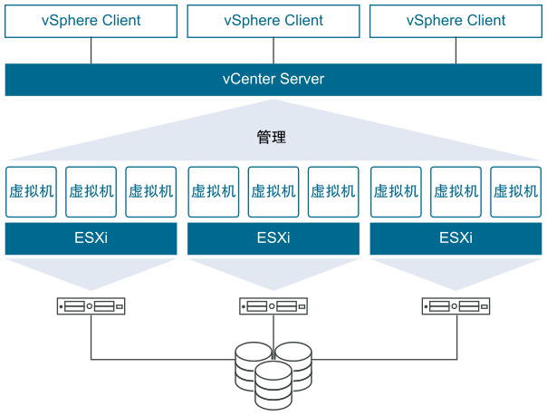
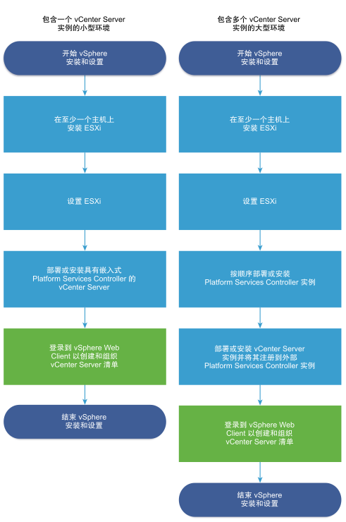

# vSphere 企业级虚拟化平台

## 1. VMware vSphere 简介

### 1.1 vSphere 是什么？

VMware vSphere 是 VMware 的企业级虚拟化平台解决方案，可将数据中心计算资源（CPU)、存储资源和网络资源的聚合计算基础架构。vSphere 将这些基础架构作为一个统一的运行环境进行管理，并为您提供工具来管理加入该环境的数据中心。

### 1.2 vSphere 核心组件

vSphere 的两个核心组件是 ESXi和vCenter Server。

- **ESXi**：是用于创建并运行虚拟机和虚拟设备的虚拟化平台。
- **vSphere**：是一项服务，充当连接网络的 ESXi主机的中心管理员，可多个主机加入资源池中，并管理这些资源。

## 2. vSpher 安装配置流程

## 3. EXSi 安装部署

### 3.1 [启动盘制作](https://blog.csdn.net/fishinhouse/article/details/81982303)

- 1、下载制作U盘启动的工具Rufus

  - [Rufus官网下载](https://rufus.akeo.ie/)

  - [Rufus 介绍说明](https://www.iplaysoft.com/rufus.html)

  > **Rufus** 是一个开源免费的**快速制作 U 盘系统启动盘**和格式化 **USB** 的实用小工具，它可以快速把 ISO 格式的系统镜像文件快速制作成可引导的 USB/启动安装盘，支持 <u>**Windows**</u> 或 **<u>Linux</u>** 启动。Rufus 小巧玲珑，软件体积仅几百多 KB，然而麻雀虽小，它却五脏俱全，而且速度极快。

- 2、Rufus 启动

Rufus 是一个绿色版软件，下载后直接运行即可以使用，无需安装。

- 3、EXSi启动盘制作

- 4、VMware-ESXi-6.5.0镜像下载

### 3.2 EXSi 安装配置过程

具体的配置过程，可以见**<u>[“知乎参考文档”](https://zhuanlan.zhihu.com/p/30129843)</u>**。

## 4. vCenter 安装部署

